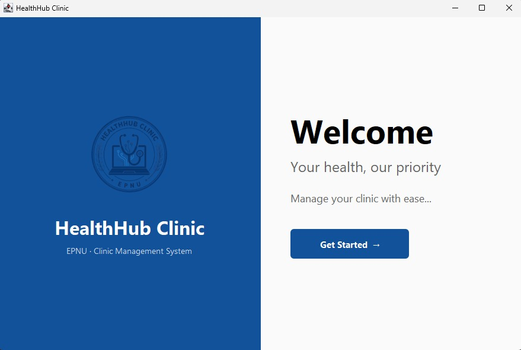
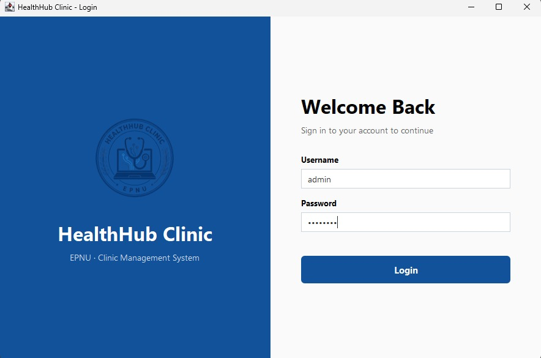
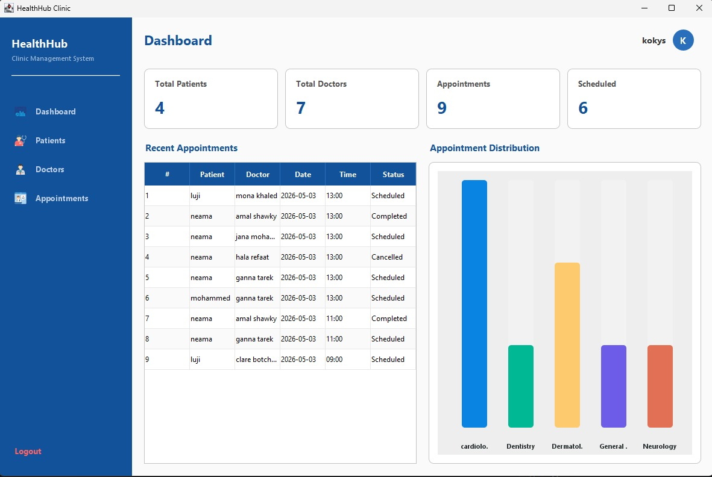
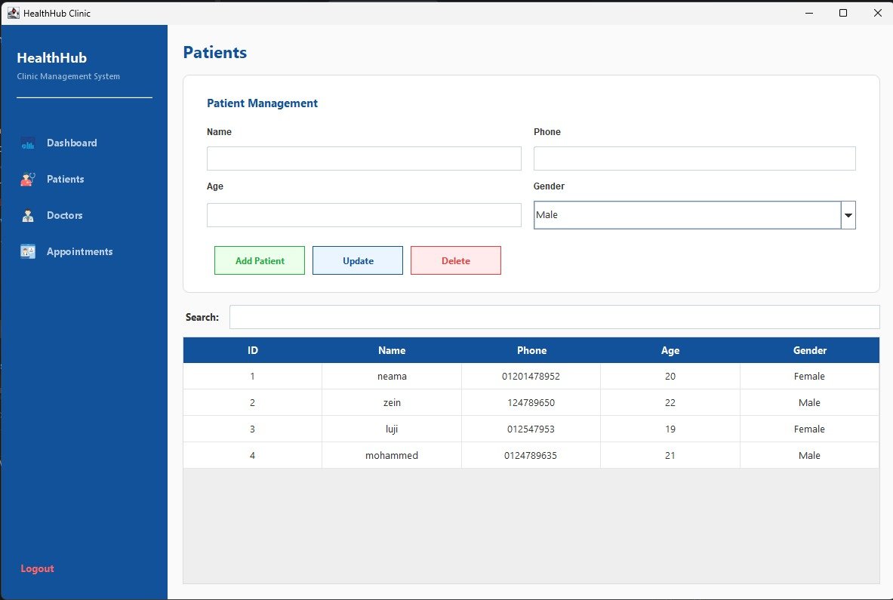
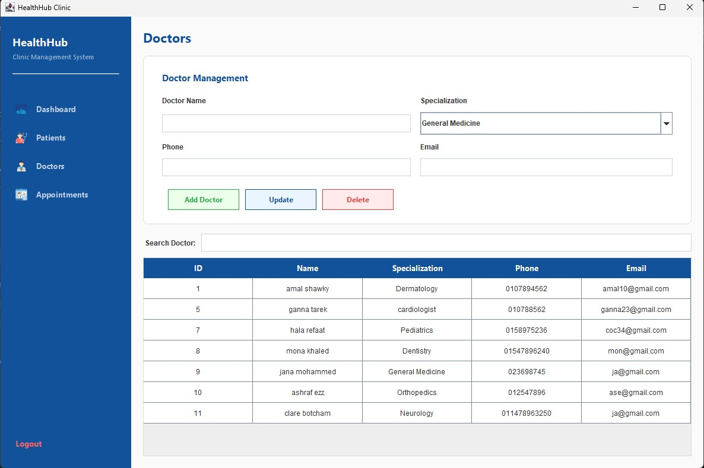
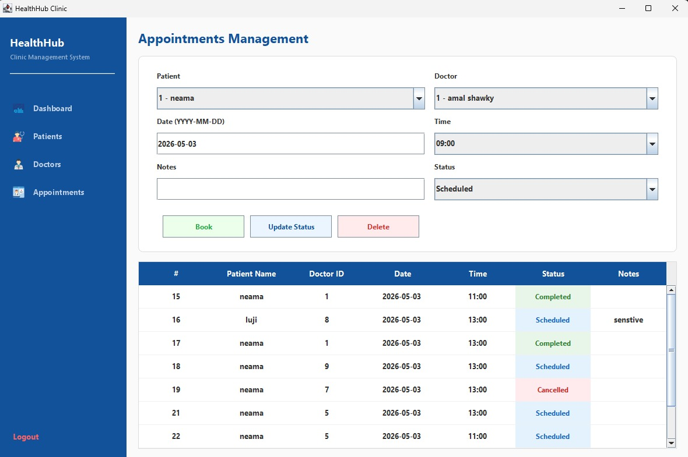

<div align="center">

# 🏥 HealthHub Clinic

### *A Modern Desktop Clinic Management System*

[](https://www.java.com/)
[](https://docs.oracle.com/javase/tutorial/uiswing/)
[](https://www.microsoft.com/sql-server)
[](https://maven.apache.org/)
[](https://www.formdev.com/flatlaf/)

[]()
[]()
[]()

</div>

---

## 📖 About

**HealthHub Clinic** is a desktop clinic management system built with **Java Swing** and **SQL Server**, designed to manage patients, doctors, and appointments through a clean, modern interface.

Developed as a **2nd-year Computer Science project** at **EPNU**, the system applies OOP, JDBC, and layered architecture in a real-world use case.

**Built with:** Java 11 · Swing · FlatLaf · SQL Server Express · Maven

---

## ✨ Features

- 🔐 **Admin Login** with secure authentication
- 🏥 **Branded Welcome Screen** with EPNU logo
- 📊 **Dashboard** with 4 live stats + bar chart by specialization
- 👥 **Patient CRUD** with real-time search
- 🩺 **Doctor CRUD** with predefined specializations
- 📅 **Appointment Booking** with color-coded status (Scheduled / Completed / Cancelled)
- 🎨 **Modern FlatLaf UI** with consistent color palette

---

## 📸 Screenshots

### 🏥 Welcome Screen



Split-screen launcher with the HealthHub brand on the left and a **Get Started** button leading to login.

---

### 🔐 Login Screen



Admin authentication via `AuthService` → `UserDAO` → SQL Server.

> 🔑 **Default Credentials:** `admin` / `admin123`

---

### 📊 Dashboard



- **4 Stat Cards:** Total Patients, Total Doctors, Appointments, Scheduled
- **Recent Appointments Table** for quick context
- **Bar Chart** showing appointment distribution per specialization (Cardiology, Dentistry, Dermatology, etc.)

---

### 👥 Patients Page



Form fields: `Name`, `Phone`, `Age`, `Gender (dropdown)`
Actions: 🟢 **Add** · 🔵 **Update** · 🔴 **Delete**
Live search filters the JTable instantly. Selecting a row populates the form.

---

### 🩺 Doctors Page



Form fields: `Name`, `Specialization (dropdown)`, `Phone`, `Email`
Specializations: Cardiology · Dentistry · Dermatology · Pediatrics · General Medicine · Orthopedics · Neurology
Same Add / Update / Delete pattern as Patients.

---

### 📅 Appointments Page



Booking form: `Patient`, `Doctor`, `Date`, `Time`, `Notes`, `Status`
Table shows all bookings with color-coded badges:

| Badge | Status |
|:-----:|:-------|
| 🟢 | Completed |
| 🔵 | Scheduled |
| 🔴 | Cancelled |

---

## 🏗️ Architecture

Layered MVC-like structure with clean separation of concerns:

```
views/      → Swing UI (frames & panels)
services/   → Business logic (AuthService)
dao/        → Database queries (JDBC)
models/     → POJOs (User, Patient, Doctor, Appointment)
utils/      → DBConnection, ColorPalette, UIHelper
```

Navigation handled via `CardLayout`.

---

## 🗄️ Database

**SQL Server Express** with 4 tables: `users`, `patients`, `doctors`, `appointments`.
Appointments link to patients and doctors via foreign keys. Auto-increment via `IDENTITY(1,1)`.

---

## 🚀 Getting Started

### Prerequisites

- Java JDK 11+
- Maven 3.6+
- SQL Server Express (`SQLEXPRESS` instance)
- SSMS · IntelliJ IDEA · Git

### Setup

```bash
# 1. Clone
git clone https://github.com/YOUR_USERNAME/HealthHubClinic.git
cd HealthHubClinic

# 2. Open in IntelliJ → wait for Maven to load dependencies

# 3. Run the SQL setup script in SSMS to create HealthHubDB

# 4. Enable TCP/IP in SQL Server Configuration Manager
#    + start SQL Server Browser service

# 5. Run Main.java
```

Default login: `admin` / `admin123`

---

## 📂 Project Structure

```
HealthHubClinic/
├── src/main/java/healthhub/
│   ├── Main.java
│   ├── views/         (6 Swing screens)
│   ├── models/        (4 POJOs)
│   ├── dao/           (4 DAOs)
│   ├── services/      (AuthService)
│   └── utils/         (DBConnection, ColorPalette, UIHelper)
├── screenshots/
├── pom.xml
└── README.md
```

---

## 🐛 Troubleshooting

<details>
<summary><strong>Cannot connect to SQL Server</strong></summary>

- Start `SQL Server (SQLEXPRESS)` service
- Enable **TCP/IP** in SQL Server Configuration Manager
- Start **SQL Server Browser** (set to Automatic)
- Check the connection string in `DBConnection.java`

</details>

<details>
<summary><strong>Driver not found</strong></summary>

Run `mvn clean install` or reload the Maven project in IntelliJ.

</details>

<details>
<summary><strong>Login rejects admin / admin123</strong></summary>

Run `SELECT * FROM users;` in SSMS — if empty, re-run the setup script.

</details>

---

## 👥 Team

**Development:** Hanin Tarek · Lujain Ahmed · Kareman Shawky · Ahmed Wael · Ahmed Abo Shady
**Design & Branding:** Hala Elhadidy · Sara Abo Hashish
**Program Director:** Eng. Osama Elbeksawy

**Institution:** Egyptian-Polish Nile University (EPNU) — Faculty of Computer Science, Year 2

---

## 📝 License

Developed for educational purposes at EPNU. All rights reserved by the HealthHub team.

---

<div align="center">

**Made with ❤️ and ☕ by the HealthHub Team @ EPNU**

</div>
